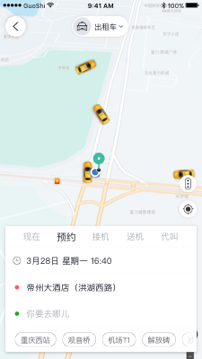
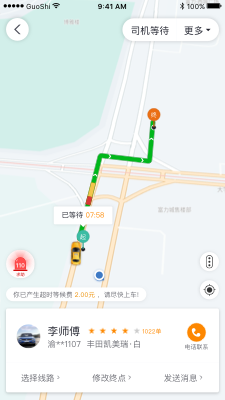
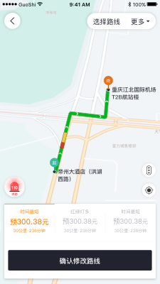

#### 出行加开源出租车项目设计效果图
###### 效果图基于sketch 55.2 低于以下版本可能无法打开或者有错乱等问题
#### 此版本设计图严禁应用于商业项目 仅供学习交流

### 产品说明

目前市面绝对大多数网约车产品均已参考DiDi作为开发原型，DiDi在网约车的道路上一直没有找到更好的盈利点，MeiTuan加入网约车让整个出行形成了完整的商业形态，本团队在14年开始涉足网约车行业，为国内10多家网约车公司提供相应的技术支持。
目前中国网约车牌照有150家，但是真正运营起来的寥寥无几，大部分出租车公司拥有比DiDi拥有更好的资源，但是相对来说技术较为落后。

##### 下载方法：
```
1、安装Git软件
2、git clone https://github.com/guoshikeji/UiDesign
```
##### 功能点：
1、[出租车](#三级标题)
2、网约车（快车）
3、代驾
4、闪电送
5、商家模块
6、优惠券
7、代步券
8、商家红包中心

### 出租车
#### 第一步：选择使用模式及确认起点、终点（此例：立即用车）
  

在出租车初始页面，有多种使用模式可以选择，包括有立即用车、预约、接机、送机、代叫，满足用户出行的更加具体的需求
用户只要填上相应的条件，即可呼叫出租车；


 
#### 第二步：呼叫出租车，等待出租车司机应答
  

呼叫出租车时，用户可以通过添加小费来获得出租车司机更快的接单；用户选择拼车，在出行高峰期时，可以更加容易打到车，
也充分的利用出行资源；用户添加备注，减少服务时造成不必要的麻烦；


#### 第三步：前往乘客起点
  

被司机接单后，司乘可通过APP内聊天功能或拨打加密电话进行沟通；
司机按照乘客的出行时间要求，到达乘客起点，乘客上车后，便正式开始行程打表计费，
如司机久等乘客未至，或姗姗来迟，平台会向用户收取一定的等待费用，用于司机空等的补偿；


#### 第四步：前往乘客终点
.png "Taxi：will call")  

乘客上车后，司机开往乘客设定的终点，途中乘客可以根据自己的需求，更换自己要到达的终点和行驶的路线；


#### 最后：支付和评价
.png "Taxi：OnlinePayment")  

乘客到达终点后，乘客可以选择现金支付或线上支付，完成支付后，乘客可以继续评价此次乘车的服务，评价会影响司机在
平台服务评分；

