#### 出行加开源出租车项目设计效果图
###### 效果图基于sketch 55.2 低于以下版本可能无法打开或者有错乱等问题
#### 此版本设计图严禁应用于商业项目 仅供学习交流

### 产品说明

目前市面绝对大多数网约车产品均已参考DiDi作为开发原型，DiDi在网约车的道路上一直没有找到更好的盈利点，MeiTuan加入网约车让整个出行形成了完整的商业形态，本团队在14年开始涉足网约车行业，为国内10多家网约车公司提供相应的技术支持。
目前中国网约车牌照有150家，但是真正运营起来的寥寥无几，大部分出租车公司拥有比DiDi拥有更好的资源，但是相对来说技术较为落后。

##### 下载方法：
```
1、安装Git软件
2、git clone https://github.com/guoshikeji/UiDesign
```
##### 功能点：
1、[出租车](#出租车)
2、[网约车](#网约车)（快车）
3、[代驾](#代驾)
4、[闪电送](#闪电送)
5、[商家模块](#商家模块)
6、[优惠券](#优惠券)
7、[代步券](#代步券)
8、[商家红包中心](#商家红包中心)

### 出租车
#### 第一步：选择使用模式及确认起点、终点（此例：立即用车）
  

在出租车初始页面，有多种使用模式可以选择，包括有立即用车、预约、接机、送机、代叫，满足用户出行的更加具体的需求
用户只要填上相应的条件，即可呼叫出租车；

    预约：用户需增填写预约时间；接机：用户需增填写航班号和班次，平台根据实时情况动态调整接机时间；
    送机：平给给出合规的接机点；代叫：用户需增添乘车人电话号码

 
#### 第二步：呼叫出租车，等待出租车司机应答
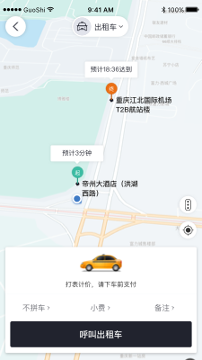 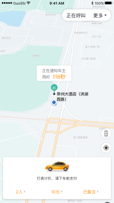 

呼叫出租车时，用户可以通过添加小费来获得出租车司机更快的接单；用户选择拼车，在出行高峰期时，可以更加容易打到车，
也充分的利用出行资源；用户添加备注，减少服务时造成不必要的麻烦；

    出租车的计费标准是以各自的打表器为准，不做线上计费；
    

#### 第三步：前往乘客起点
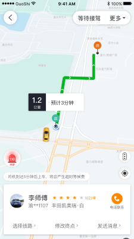  

被司机接单后，司乘可通过APP内聊天功能或拨打加密电话进行沟通；
司机按照乘客的出行时间要求，到达乘客起点，乘客上车后，便正式开始行程打表计费，
如司机久等乘客未至，或姗姗来迟，平台会向用户收取一定的等待费用，用于司机空等的补偿；

    乘客可以看到接单司机的服务评分，车牌号，车辆型号及颜色等基础信息；
    用户在这个状态，可以实时看到司机的位置，和司机到达起点的预估时间；

#### 第四步：前往乘客终点
.png "Taxi：will call")  

乘客上车后，司机开往乘客设定的终点，途中乘客可以根据自己的需求，更换自己要到达的终点和行驶的路线；


#### 最后：支付和评价
.png "Taxi：OnlinePayment") 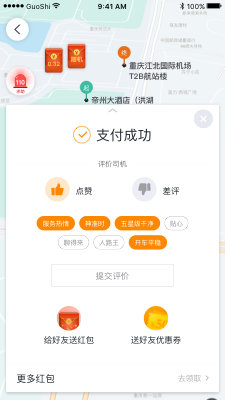 

乘客到达终点后，乘客可以选择现金支付或线上支付，完成支付后，乘客可以继续评价此次乘车的服务，评价会影响司机在
平台服务评分；

    用户的线上支付方式，现可支持支付宝、微信支付、银联支付，和平的钱包支付；
    免单支付：乘客只需向钱包充值平台规定的金额，此次乘车即可免单；

### 网约车
###### 网约车与出租车的使用方式基本一致，以下将列举完成的的不同点
#### · 多种车型
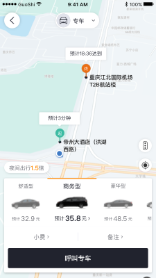  

乘客在呼叫网约车时，可选择不同车型，不同车型的计价也有不同，平台会根据起终点给出相应的费用预估；


#### · 计价方式
.png "Taxi：OnlinePayment") .png "Taxi：Service Evaluatio") 

网约车采取线上计费方式，线上提供计费细则；支付方式只保留线上支付；

### 代驾
#### 代驾模式
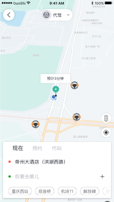 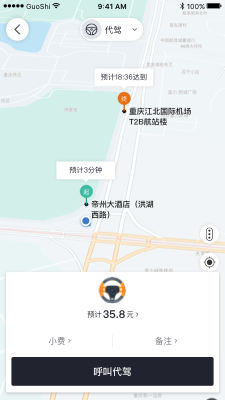 

在代驾的初始页面，有三种使用模式可以选择，分别是现在、预约、代叫，满足用户更加具体的需求
用户填上相应的条件后，进入呼叫页面，在该页面展示了此次代驾服务所需的价钱，亦可添加备注和小费；
 
 #### 呼叫代驾
 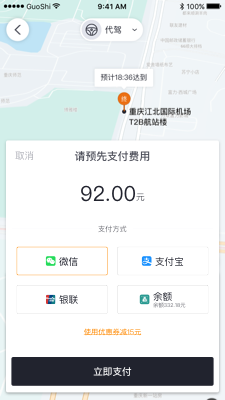 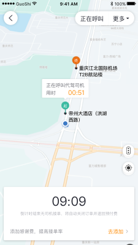 

代驾服务采取先付费，后叫司机的模式，如呼叫无果，平台将立即返还乘客的付费；
 
#### 代驾状态
 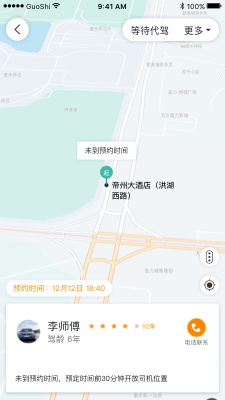 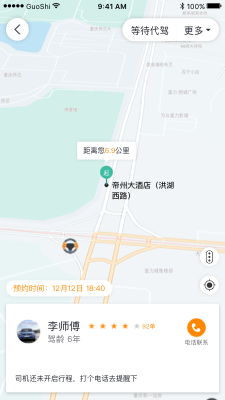 

呼叫代驾司机成功后，代驾司机在规定时间点到达起点，若用户超过允许时间未到达代驾点，用户需向代驾司机支付额外的等待费用。
司机将车驾驶到终点后，乘客向司机支付完额外费用,此次代驾服务即为结束；事后用户可追加评价
    
    追加的额外费用：过路费、过桥费等
 
### 闪电送
#### 闪电送模式
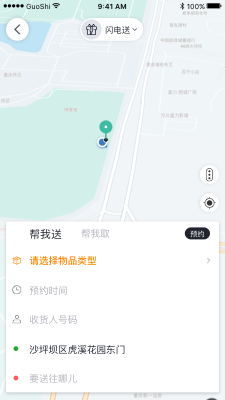 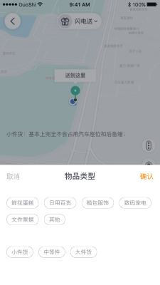 

闪电送：网约车/出租车提供服务的非超远距离的送货服务；在闪电送中，用户存在两种角色的可能，
分别为：收货人（帮我取）、发货人（帮我送）；使用模式分即时和预约；

    用户须填写详细的/发货人的地址和电话号码；
    
#### 发布订单
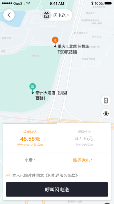 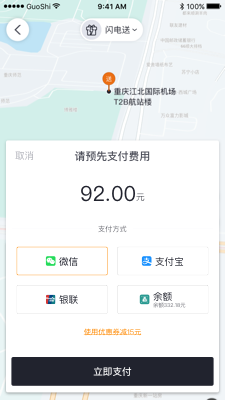 

用户在发布订单前，可选择送货方式和添加小费；完成运费预付，即成功发单，用户只需等待司机接单即可；
    
    闪电快达：有严格的送达时间要求，且多用时较短，与网约车相似，价格也差不多；
    顺路送达：送达时间相对宽松，价格相对闪电快达便宜很多；

    
#### 快递状态
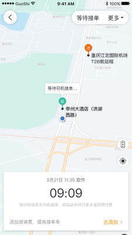 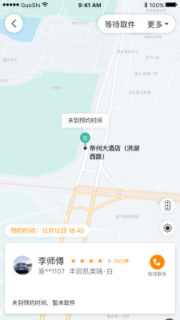 

当接单司机处在取件和配送状态时，发单用户可实时查看司机位置；配送时，平台将会向收货人的电话号码发送带有收货码的短信；
收货人签收货物时，向司机告知收货码，司机验证无误后，即为完成签收；

### 商家模块

### 优惠券

### 代步券

### 商家红包中心


